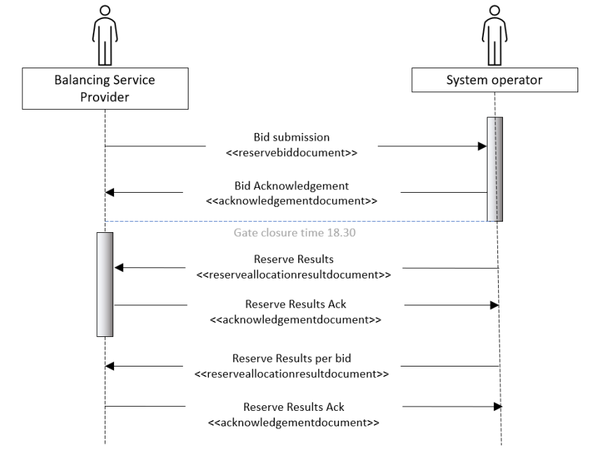

# Information Process Flow
This page describes the flow of information between BSPs, Fingrid and others.

From the BSP's perspective, information process flow consists of the following:

* Sending bids and receiving acknowledgements
* Receiving reserve allocation reports and sending acknowledgements
  * Reserve allocation results are received both as a daily document as well as on the bid level.

The image below illustrates the message flows between the BSP and TSO related to the FCR hourly market.

BSPs send bids to VAKSI via ECP/EDX, and from there VAKSI will handle FCR procurement. As a fallback solution, BSPs can additionally send FCR bids via the VAKSI web UI.
