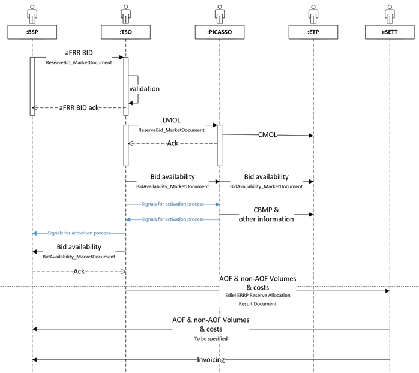

# Information Process Flow
This page describes the flow of information between BSPs, Fingrid, PICASSO and others.

The information flow from the BSP perspective consists of the following: 
* Sending bids and receiving acknowledgements
* Receiving bid availability information
* Receiving activation signals (real-time)

In the picture below, messages are represented with an arrow and acknowledgements are represented with dashed arrows. Real time signals are represented as blue arrows. 

Fingrid's market management system VAKSI will handle all BSP messages and forward them to the PICASSO market place. 
