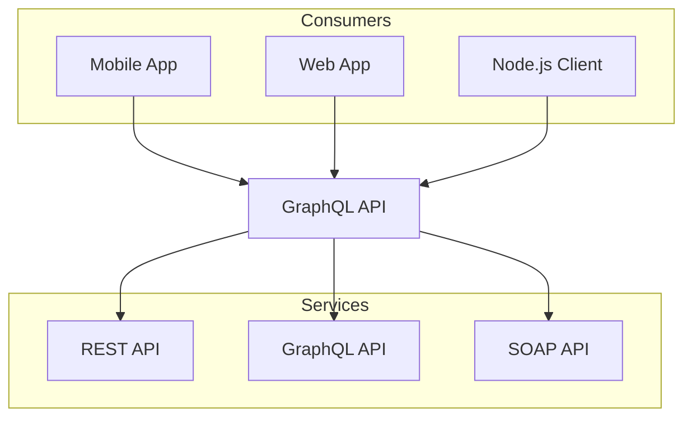

# Hello World

- [x] Tee pohjat
- [ ] Tyylitys
- [ ] Liitä validaattori

```ts
console.log("Hello world, a code block!");
```

```html
<html>
	<head>
		<title>esimerkki</title>
	</head>
</html>

```

## Mermaid -kaavio



> [!important]
>
> Tärkeää!
> 


>
> Blockquote
> 


# Pääotsikko

## Alaotsikko

* lista
* toinen listan palikka
