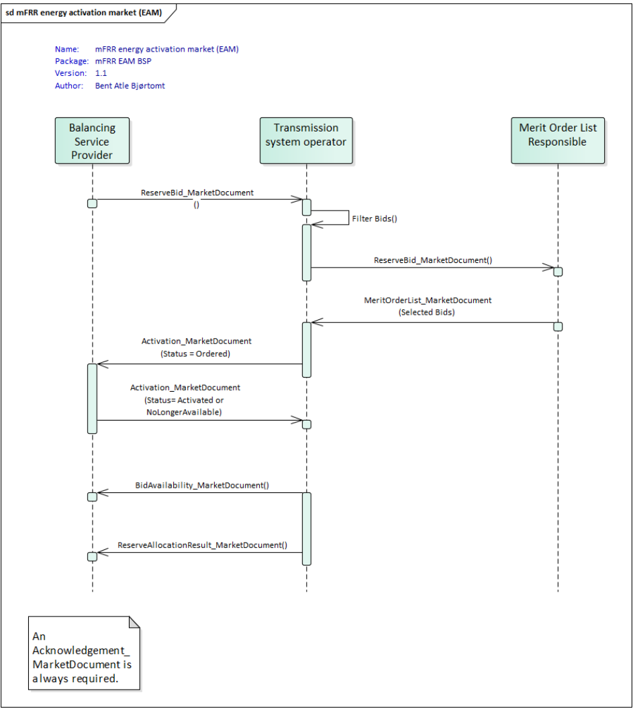

# Information Process Flow

This page describes the information process flow between BSPs, Fingrid, the Nordic common merit order list (CMOL), and others.

From the BSP's perspective, information process flow consists of the following:
* Sending bids and receiving acknowledgements
* Receiving activation order messages and sending responses to the orders
* Receiving bid availability reports and activation reports

Additionally, BSPs can receive market results from transparency platforms and activation settlement results from eSett, which will not be covered in detail in this wiki.

BSPs send bids to the VAKSI platform via ECP/EDX, and from there VAKSI will handle forwarding messages to the Nordic CMOL (and MARI when it is accessed). As a fallback solution, BSPs can also use the VAKSI web UI to send bids to the system, however this has limitations such as not being able to leave conditionally linked bids.
