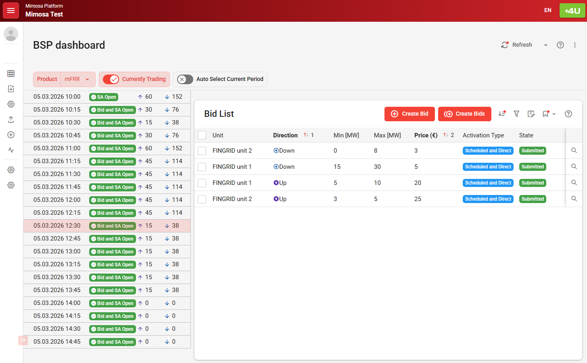

# Mimosa
## Overview

**During 2027, the new market management system Mimosa will replace the current VAKSI system, which has been in use for more than 18 years. The objective of the renewal is to better meet the needs arising from a rapidly changing operating environment, expanding reserve markets, and increasing user and process requirements.**

The energy transition together with the European integration and continuous growth of reserve markets places increasingly complex demands on information systems. The purpose of Mimosa is therefore to better support reserve markets, balance management, and transmission system operation, while improving system integrability, performance, and ease of further development. 

The Mimosa implementation project will proceed in two stages. In the first stage, energy market functionalities (MARI & PICASSO) will be introduced, followed by capacity markets in the second stage. Training and testing for market participants on the new platform will take place in autumn 2026, and the platform is planned to enter operational use when the accession to the European mFRR balancing platform, MARI, takes place in Q1/2027. For other functionalities, implementation will take place no earlier than the end of 2027. 

