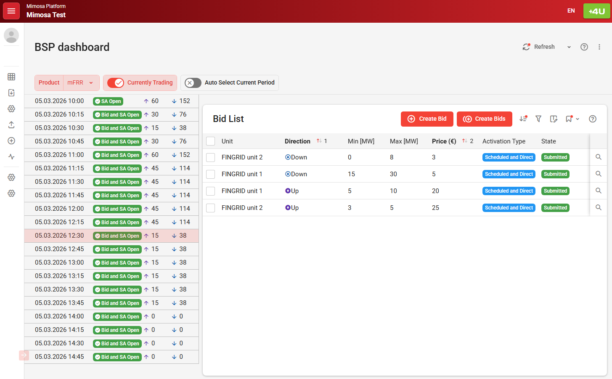

# Mimosa
## Overview

**During 2027, the new market management system Mimosa will begin replacing the current VAKSI system, which has been in use for more than 18 years. The objective of the renewal is to better meet the needs arising from a rapidly changing operating environment, expanding reserve markets, and increasing user and process requirements.**

The energy transition together with the European integration and continuous growth of reserve markets places increasingly complex demands on information systems. The purpose of Mimosa is therefore to better support reserve markets, balance management, and transmission system operation, while improving system integrability, performance, and ease of further development. 

The Mimosa implementation project will proceed in two stages. In the first stage, mFRR and aFRR energy market functionalities (including MARI & PICASSO) will be introduced, followed by capacity markets in the second stage. Training and testing for market participants on the new platform will take place in early 2027, and the platform is planned to enter operational use when the accession to the European mFRR balancing platform, MARI, takes place in Autumn 2027. For other functionalities, implementation will take place in 2028. 

More information on Mimosa can be found in [Fingrid web pages](https://www.fingrid.fi/mimosa).

If you have any questions, feel free to contact the project team directly at mimosa@fingrid.fi

## Schedule

The Mimosa implementation project will progress in two phases. In the first phase, the mFRR and aFRR energy market functionalities (MARI & PICASSO) will be deployed, and in the second phase the capacity markets. Market participants’ onboarding and testing on the new platform will be carried out during early 2027.
Message exchange towards market participants will remain unchanged. The platform is planned to be taken into operational use together with the MARI connection in Autumn 2027. The deployment of the remaining functionalities will take place in 2028.

| Event | Time |
| ------------- | ------------- |
| Procurement decision  | 6/2025  |
| Delivery project start  | 9/2025  |
| Base product installation ready | 1/2026 |
| Solution presentations, webinars | 10/2026 |
| Market participant tests | 2-3/2027 |
| Energy markets Go-Live (Stage 1)| 9-10/2027 |
| Capacity markets Go-Live (Stage 2) | 2028 |
